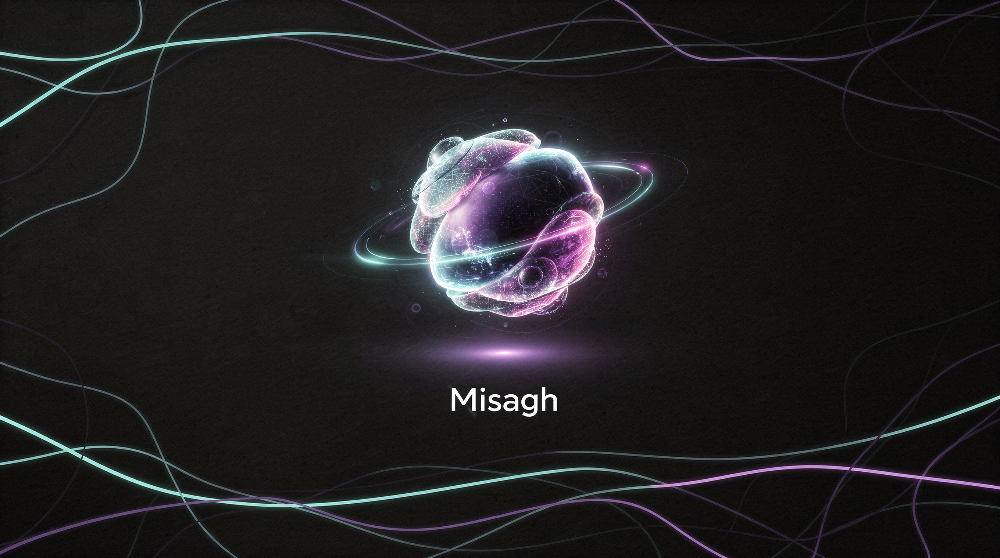

<div align="center">


# 🤖 دستیار هوشمند میثاق (MIsagh AI)

**بازسازی حرفه‌ای هوش مصنوعی به عنوان دستیار تلگرام اختصاصی شما**

پشتیبانی از GPT-5.5 · Anthropic Claude (Opus / Sonnet / Haiku) · قابلیت پردازش تصویر · ویس به متن · ساخت تصویر
<br/>پاسخ‌های فوق‌العاده سریع، بدون محدودیت‌های روزانه و دارای حالت‌های چت اختصاصی فارسی.

<p align="center">


</p>

</div>

---

چت‌بات‌های تحت وب فوق‌العاده هستند، اما اغلب با کندی، محدودیت‌های شدید ریپیت یا فیلترینگ مواجه می‌شوند. پروژه **میثاق** قوی‌ترین مدل‌های هوش مصنوعی دنیا از شرکت‌های **OpenAI و Anthropic** را بدون واسطه و محدودیت، مستقیماً وارد تلگرام شما می‌کند.

## ✨ قابلیت‌های کلیدی

- ⚡ **پاسخ‌دهی فوق سریع** — پردازش و ارسال پاسخ‌ها معمولاً بین ۳ تا ۵ ثانیه.
- 📝 **ارسال کلمه به کلمه (Streaming)** — نمایش پاسخ‌ها به صورت زنده و در لحظه تولید.
- 🧠 **دسترسی به برترین مدل‌ها** — پشتیبانی از **GPT-5.5** و خانواده محبوب **Claude** از طریق سرویس [OpenRouter](https://openrouter.ai/).
- 👁️ **پردازش تصویر (Vision)** — هر تصویری را برای ربات بفرستید، آن را تحلیل کرده و به سوالات شما درباره آن پاسخ می‌دهد.
- 🎨 **ساخت تصویر و نقاشی** — تبدیل متن به تصاویر جذاب با استفاده از مدل تصویرساز هوش مصنوعی (با سوییچ به حالت 👩‍🎨 *طراح و نقاش*).
- 🎤 **تبدیل ویس به متن (Transcription)** — ویس‌های فرستاده شده را به صورت خودکار با ابزار Whisper به متن تبدیل می‌کند.
- 🎭 **دستیارهای تخصصی فارسی** — دارای حالت‌های چت شخصی‌سازی شده به زبان فارسی (دستیار عمومی، برنامه‌نویس، طراح، ویرایشگر متن و مترجم همراه).
- 🔒 **کنترل دسترسی هوشمند** — امکان محدود کردن ربات فقط برای آی‌دی‌های تلگرام خودتان و دوستانتان.
- 💰 **مدیریت بودجه** — مشاهده دقیق میزان مصرف و هزینه‌های API با دستور `/balance`.

## 🧠 مدل‌های پشتیبانی شده

تمام مشخصات مدل‌ها در مسیر [`config/models.yml`](config/models.yml) تعریف شده‌اند و بدون نیاز به تغییر در کدها، قابل ویرایش هستند.

| مدل | ارائه‌دهنده | پردازش تصویر | هوش | سرعت | قیمت | هزینه هر ۱۰۰۰ توکن (ورودی/خروجی) |
|---|---|:---:|:---:|:---:|:---:|---|
| **GPT-4o mini** *(پیش‌فرض)* | OpenAI | ✅ | 🟢🟢🟢🟢 | 🟢🟢🟢🟢🟢 | 🟢🟢🟢🟢🟢 | $0.00015 / $0.0006 |
| **GPT-4o** | OpenAI | ✅ | 🟢🟢🟢🟢🟢 | 🟢🟢🟢🟢 | 🟢🟢🟢🟢 | $0.0025 / $0.01 |
| **GPT-5.5** | OpenRouter | ✅ | 🟢🟢🟢🟢🟢 | 🟢🟢🟢 | 🟢🟢 | $0.005 / $0.03 |
| **Claude Opus 4.8** | OpenRouter | ✅ | 🟢🟢🟢🟢🟢 | 🟢🟢 | 🟢🟢 | $0.005 / $0.025 |
| **Claude Sonnet** | OpenRouter | ✅ | 🟢🟢🟢🟢🟢 | 🟢🟢🟢🟢 | 🟢🟢🟢 | $0.003 / $0.015 |
| **Claude Haiku** | OpenRouter | ✅ | 🟢🟢🟢🟢 | 🟢🟢🟢🟢🟢 | 🟢🟢🟢🟢 | $0.001 / $0.005 |

---

## 🎭 حالت‌های چت فارسی (Chat Modes)

ربات میثاق دارای ۵ حالت چت کاملاً فارسی‌سازی شده برای کارهای مختلف شماست:

| حالت چت | عملکرد ربات |
| :--- | :--- |
| **👩🏼‍🎓 دستیار هوشمند میثاق** | پاسخ به سوالات عمومی، یادگیری، استدلال و راهنمایی همه‌جانبه شما. |
| **👩🏼‍💻 برنامه‌نویس میثاق** | نوشتن، اشکال‌زدایی، توضیح و بهینه‌سازی کدهای برنامه‌نویسی به زبان‌های مختلف. |
| **👩‍🎨 طراح و نقاش** | ساخت و نقاشی تصاویر خلاقانه بر اساس توضیحات انگلیسی شما. |
| **📝 ویرایشگر متن** | اصلاح غلط‌های املایی، نگارشی و زیباسازی متون بدون تغییر در معنای اصلی آن‌ها. |
| **🌐 مترجم همراه** | ترجمه سریع و روان متون بین زبان‌های فارسی، انگلیسی و سایر زبان‌ها. |

---

## 🚀 راه اندازی سریع (Quick Start)

**۱.** دریافت کلید API از [OpenAI API key](https://openai.com/api/).

**۲.** *(اختیاری)* دریافت کلید API از [OpenRouter](https://openrouter.ai/keys) برای دسترسی به مدل‌های **Claude** و **GPT-5.5**.

**۳.** ساخت یک ربات تلگرام و دریافت توکن از طریق [@BotFather](https://t.me/BotFather).

**۴.** تغییر نام فایل‌های پیکربندی و وارد کردن توکن‌ها در مسیرهای زیر:

```bash
mv config/config.example.yml config/config.yml
mv config/config.example.env config/config.env
# سپس فایل config/config.yml را ویرایش کرده و کلیدهای دریافتی را جایگزین کنید.
